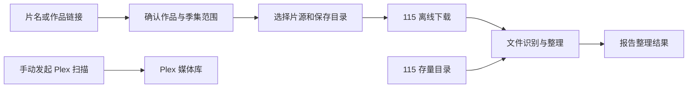

# telepiplex

**在 Telegram 里完成影视搜索、115 下载与媒体整理。**

[English](README_EN.md) · [快速开始](#快速开始) · [日常使用](#日常使用) · [模块说明](#功能模块) · [MIT License](LICENSE)

telepiplex 是一个自托管的媒体管理工具。发送准确片名或作品链接，确认作品和季集范围，选择片源与保存目录，就能把搜索、115 离线下载、文件整理串成一条可跟踪的任务。已有的 115 媒体也可以单独扫描整理；Plex 媒体库由独立模块按需管理。

一个 Docker 容器承载常驻 Host，业务能力通过 Feature 模块按需安装、独立更新。日常操作在 Telegram 中完成。



自动任务结束于媒体整理。Plex 扫描需要单独发起，并依赖你已有的媒体访问或挂载方案。

## 能做什么

- **先确认作品，再找片源。** Wikipedia 与 Wikidata 用于发现作品，TVDB、TMDB、豆瓣和 AniList 按各自职责补全已确认资料。同名作品交给你选择，搜索不依赖 AI。
- **按电影、全剧、整季或单集搜索。** 通过 Prowlarr 查询已配置的索引器，校验作品身份、年份和季集范围，再去重、排序，最多展示 12 个片源。
- **下载到 115 并跟踪进度。** 支持扫码或 Access/Refresh Token 授权、保存目录选择、Token 自动刷新和下载状态轮询。
- **按真实文件整理。** 逐文件识别电影、剧集和外挂字幕，生成统一目录与文件名；无法可靠映射的文件保留原位，目标冲突单独报告。
- **在 Telegram 管理模块。** 安装、配置、更新、启停和回滚均有交互入口；常规模块更新不需要重启 Host 容器。
- **保留可排查的任务记录。** 各阶段复用自己的状态消息，拦截过期按钮和重复提交，输出人类可读日志与结构化诊断日志。

## 功能模块

| Feature | 用途 | 安装依赖 | 详细说明 |
| --- | --- | --- | --- |
| `download` | 115 授权、离线下载、存储访问与下载清理 | 无 | [download](features/download/README.md) |
| `search` | 作品确认、季集选择、元数据补全与片源搜索 | `download` | [search](features/search/README.md) |
| `rename` | 下载后整理、115 存量媒体扫描、逐文件命名与移动 | `download`、`search` | [rename](features/rename/README.md) |
| `sync` | 独立手动 Plex 扫描、任务查看及 MCP 管理接口 | 无；实际操作需连接 Plex | [sync](features/sync/README.md) |
| `caption` | 字幕查找与统一化的预留模块 | 当前无业务能力 | [caption](features/caption/README.md) |

首次使用完整搜索与整理流程，依次安装 `download → search → rename`。`sync` 按需安装；`caption` 当前仅验证打包、安装与启动，没有字幕搜索或处理功能。

## 快速开始

### 1. 准备运行环境

需要一台可运行 Docker Compose 的服务器。当前正式镜像构建目标为 **Linux / amd64**。

准备好 Telegram Bot Token、你自己的 Telegram 数字用户 ID，以及可用的 115 授权。使用片源搜索时，还需要一个已配置索引器的 Prowlarr 实例。容器应能访问 Telegram、115 和所启用的元数据服务。

从仓库下载源码 ZIP 并解压，在解压目录准备配置：

```bash
mkdir -p data
cp config/config.yaml.example data/config.yaml
```

编辑 `data/config.yaml`，至少替换 `bot_token` 与 `allowed_user`。`allowed_user` 是数字用户 ID，不是用户名；当前权限配置只允许一个用户。

```yaml
log_level: info
bot_token: "your_bot_token"
allowed_user: 123456789
plugins:
  root: /config/plugins
  catalog: https://raw.githubusercontent.com/countott/telepiplex/catalog/catalog.yaml
  catalog_refresh_interval: 21600
```

更多运行参数见 [完整配置模板](config/config.yaml.example)。Host 配置只负责 Bot 和模块运行环境；115、Prowlarr、Plex 等配置分别保存在各 Feature 内。

### 2. 启动容器

编辑 [docker-compose.yaml](docker-compose.yaml)，把默认占位挂载 `/to/your/path/config:/config` 改为刚才准备的目录：

```yaml
volumes:
  - ./data:/config
```

然后运行：

```bash
docker compose up -d
docker logs -f telepiplex
```

默认使用正式镜像 `ghcr.io/countott/telepiplex:latest`。Bot 使用轮询接收消息，默认 Compose 不需要暴露端口。Unraid 用户也可以使用同一镜像，将持久化目录映射到容器的 `/config`。

配置文件在容器内的实际位置是 `/config/config.yaml`。Prowlarr、Plex 等服务地址必须从容器内可达；容器中的 `127.0.0.1` 指向容器自身。

### 3. 安装并配置模块

在 Telegram 打开你的 Bot，发送 `/start`，再发送 `/plugin`。

依次点击安装 `download`、`search`、`rename`。只有依赖满足的 ready 候选才显示安装按钮；缺少依赖时，页面会提示先安装哪个模块。安装按钮和更新按钮都绑定该 Feature 的最新稳定兼容版本。telepiplex 不会自动安装模块。

安装后发送 `/config`，选择模块并按提示配置：

| 模块 | 首次配置内容 |
| --- | --- |
| `download` | 通过 `/auth` 录入 Access/Refresh Token，或按提示扫码授权；在“保存目录”中至少添加一个 115 目录 |
| `search` | 填写 Prowlarr 服务地址和 API Key；按需配置 TMDB API Read Access Token、TVDB 凭据 |
| `rename` | 核对分类目录；需要处理规则无法覆盖的文件名时，再配置 AI 服务 |
| `sync`（可选） | 填写 Plex 地址与 Token；海报等增强功能按需配置 TMDB、Fanart.tv |

115 保存目录分两步录入：先填写按钮显示名称，再填写实际路径。例如显示名称 `真人电影`，路径填写 `真人电影`；多级路径可填写 `series/live action`。在 Telegram 输入路径时不要以 `/` 开头，以免被识别为命令。

保存目录与分类目录都是 **115 内的路径**。download 的 `save_directories` 决定离线下载位置；search 与 rename 的 `category_folder` 决定分类位置，默认分为真人电影、动画电影、真人剧集、动画剧集。自定义分类时，保持两个模块的目录配置一致。分类数组等高级配置直接编辑对应 YAML，字段结构见各模块默认配置。

Wikipedia、Wikidata、豆瓣和 AniList 不需要 API Key。search 没有 AI 配置；rename 的 AI 仅处理规则无法确定的文件映射，不能确认作品身份、覆盖外部元数据或授权删除。通过 Telegram 保存配置时会执行校验和运行实例切换；失败则恢复旧配置与旧路由。

## 日常使用

### 搜索并下载

发送准确片名，可以附带年份或明确季集范围：

```text
/s 星际穿越 2014
/s 西部世界
/s 西部世界 S01
/s 西部世界 S01E01
```

也可以直接发送豆瓣、Wikipedia、Wikidata、TVDB、TMDB 或 AniList 的作品链接；链接直接发到对话中，不要加 `/s` 前缀。

按界面依次确认作品、选择可用的全剧／整季／单集范围，再选择片源与 115 保存目录。系统会展示下载进度，并在下载完成后交给已启用的 rename 整理。rename 未安装或未启用时，下载完成会明确提示“已跳过自动整理”。

搜索需要准确的影视名称，不支持描述性找片、错别字推断或截图识别。Season 0、Special、OVA、OAD 等附加内容不进入搜索；未播、日期未知或缺少可靠季集结构时，相关范围会受限，不会猜测补齐。

### 整理已有媒体

发送 `/rename`，按提示选择 115 存量目录并确认作品。整理以实际文件证据为基础，不要求原目录已经规范。

典型结果如下，实际名称来自已确认元数据：

```text
真人电影/
└── 星际穿越 (Interstellar)/
    └── Interstellar.mkv

真人剧集/
└── 西部世界 (Westworld)/
    └── Westworld Season 01/
        ├── Westworld S01E01.mkv
        └── Westworld S01E01.chi.srt
```

作品目录使用 `中文名 (English Title)`，媒体文件使用已确认英文名；剧集统一季集编号。外挂字幕保留实际扩展名，名称中的 `.chi` 是统一标记，不代表系统检测到了中文字幕。

**下载清理与存量整理的规则不同：** download 在自动交接前会删除下载内容中的非视频文件，以及低于 `minimum_video_size_mib` 的视频，默认阈值为 **100 MiB**；这包括下载包里的外挂字幕。阈值设为 `0` 仍会过滤非视频文件。如果没有合格视频，会在删除前停止。`/rename` 整理存量媒体时则保留无法匹配的文件和字幕，并报告待确认项。需要保留下载包附带文件时，应先了解这一规则，详见 [download 清理说明](features/download/README.md)。

### 管理 Plex

安装并配置 `sync` 后，发送 `/scan` 选择一个或全部 Plex 媒体库进行扫描，发送 `/sync` 查看任务。`/scan` 只提交扫描，不创建海报、音轨或字幕增强任务。

telepiplex 不提供 115 到 Plex 的文件挂载。请先确保 Plex 能通过你已有的方案访问媒体；整理完成不会自动触发 Plex 扫描。需要 MCP 管理接口时，参阅 [sync 文档](features/sync/README.md)。

### 常用命令

| 命令 | 作用 |
| --- | --- |
| `/start` | 查看当前可用功能 |
| `/plugin` | 安装、更新和管理 Feature |
| `/config` | 配置已安装 Feature |
| `/auth` | 配置 115 授权 |
| `/s`、`/search` | 按准确片名搜索 |
| `/m`、`/magnet` | 投递磁力链接，例如 `/m magnet:?xt=urn:btih:…` |
| `/rename` | 扫描并整理 115 存量媒体 |
| `/scan` | 手动扫描 Plex 媒体库 |
| `/sync` | 查看 Plex 任务 |

菜单随已启用且依赖可用的模块动态生成。同一用户同时只有一个活动交互；处理中可使用当前消息上的取消按钮。**退出**结束执行前的交互；**取消任务**停止后续工作，已完成的远端变更会如实报告；只有具备可验证逆操作时，才会出现**取消并回滚**。取消下载不会删除已下载文件。

## 配置、日志与更新

所有持久化数据位于 `/config`，备份时应保留整个目录：

| 容器内路径 | 内容 |
| --- | --- |
| `/config/config.yaml` | Host 与 Telegram 配置 |
| `/config/plugins/<plugin_id>/config.yaml` | Feature 私有配置 |
| `/config/plugins/<plugin_id>/config.yaml.example` | 已安装 Feature 的配置模板 |
| `/config/plugins` | 模块版本、运行环境与持久状态 |
| `/config/logs` | 按 Host 启动会话分组的日志 |

查看当前日志：

```bash
docker logs -f telepiplex
```

每次 Host 启动会在 `/config/logs/` 建立新会话目录，包含 `telepiplex.human.log`、`telepiplex.machine.jsonl` 和对应 `feature-<plugin_id>` 分类日志。人类日志为中文业务时间线，JSONL 保存结构化诊断信息；敏感字段经脱敏。日志按完整会话保留，最多最近 30 次启动且不超过 30 天。

Feature 通过 `/plugin` 更新。Host 启动时刷新官方目录，默认每 6 小时再次检查；发现更新会通知授权用户，点击“确认更新”后才执行，telepiplex 不会静默更新。新版本经过校验、独立进程健康检查、旧任务排空和路由切换，失败时保留旧版本。

更新 Host 镜像则需要重建容器：

```bash
docker compose pull
docker compose up -d
```

Host 与 Feature 独立发布，镜像更新不会替你更新已安装模块。新模块要求更高 Host API 时，先更新 Host，再按依赖顺序更新 Feature。

<details>
<summary><strong>高级配置、离线安装与兼容性</strong></summary>

### 高级/离线操作

普通安装使用 `/plugin` 按钮。固定版本或离线包使用 `/plugin install <name@version|artifact.tpx>` 和 `/plugin update <name@version|artifact.tpx>`，也接受容器内已存在的绝对 `.tpx` 路径。

以下两个安装示例只展示历史版本语法；实际使用时以 catalog 中可用且兼容的版本为准：

```text
/plugin install search@1.0.0
/plugin update search@1.0.0
/plugin enable search
/plugin disable search
/plugin rollback search
/plugin remove search
/plugin status search
/plugin doctor
```

`plugins.catalog` 支持 HTTPS 地址或本地文件。官方滚动入口为 `https://raw.githubusercontent.com/countott/telepiplex/catalog/catalog.yaml`。Feature Release 附带完整 catalog 快照，可保存为 `/config/plugins/catalog.yaml`，再将配置指向该路径；离线使用还需要准备相应包与运行依赖。

旧版默认 catalog 是 `<plugins.root>/catalog.yaml`；仅当这个 legacy 文件缺失时，telepiplex 才回退到官方 URL。已存在的 legacy 文件继续使用本地目录；其他显式本地路径即使当前文件缺失，也保持本地配置意图。远程刷新失败时保留上一次有效目录。

### 大目录与旧配置

download 的 `enable_tree_snapshot_references` 默认关闭，完整树上限为 1,000 个后代节点。download 和 rename 均支持分页快照后，才可显式开启；开启后支持最多 20,000 个节点、深度 8，并在整理前校验全部页面和摘要。快照数据库当前没有自动回收，磁盘占用会随任务增长；回退前需要保留双方快照与活动任务。详细步骤见 [download](features/download/README.md) 与 [rename](features/rename/README.md)。

当前搜索到整理链路使用 `media_metadata v2`。从旧版本升级时，先阅读各模块迁移说明：例如 search 通过包内迁移删除旧 AI 配置，sync 的旧 `ai:` 段需要按模块文档处理。不要把旧版本的活动任务视为可自动迁移。

### 本地镜像

源码构建使用独立镜像名 `telepiplex:latest`：

```bash
./build.sh
TELEPIPLEX_IMAGE=telepiplex:latest \
TELEPIPLEX_PULL_POLICY=never \
docker compose up -d
```

本地构建不会改变 `ghcr.io/countott/telepiplex:latest` 的正式发布内容。

</details>

<details>
<summary><strong>架构、发布与开发</strong></summary>

### Host 与 Feature

Host 负责 Telegram 接入、命令路由、任务与事件持久化、配置和模块生命周期。Feature 在各自 Python 虚拟环境与子进程中运行，通过 Unix Domain Socket 调用 capability；socket 位于临时目录 `/tmp/telepiplex`。业务源码不打入 Host 镜像，各 Feature 不直接 import 其他 Feature。

当前 Host API 1.7 提供持久化任务消息段，在同一阶段复用同一条消息并处理重复回调、封口与恢复。它延续 Host API 1.6 的身份／阶段里程碑和 Host API 1.5 的逐版本配置迁移合同。模块通过 `manifest.yaml` 声明 `host_api` 范围和 capability 依赖。

### 独立发布

`main` 是 Core/Host 与五个 Feature 的有效源码分支。Host 使用 `telepiplex-v<semver>` tag，发布前验证提交已包含在远端 `main`；正式流水线生成 `ghcr.io/<owner>/telepiplex:<semver>` 与 `latest` 镜像，创建同名 GitHub Release 并强制设为 **Latest**。普通 `main` push 不更新正式镜像或 Latest 入口。

Feature 使用 `<plugin_id>-v<semver>` 独立 tag，生成不可变 `.tpx`，以 `name@version` 标识包身份。`manifest.yaml` 中的 Feature version 与包版本必须一致；内容变化需要新版本，不覆盖已发布身份。Feature Release 不占用 Latest，Host Release 不携带 Feature 或 catalog 资产。

每次 Feature 发布更新 `catalog` 分支的 `catalog.yaml` 与校验和，记录包地址、SHA-256、来源提交、兼容范围和 capability 依赖，并附带发布时的完整目录快照。

当前五个模块是全新技术身份，最初分别使用 `download-v1.0.0`、`search-v1.0.0`、`rename-v1.0.0`、`sync-v1.0.0`、`caption-v0.1.0`；这些是历史起始标签，不代表当前推荐版本。旧 `plugin_id` 不会自动迁移为新身份。已退役分支的维护记录见 [归档说明](docs/archive/2026-07-26-feature-telepiplex-core.md)。

### 开发入口与验证

| 目录 | 内容 |
| --- | --- |
| `app/` | Host 运行层、Telegram 交互与模块管理 |
| `sdk/` | Feature SDK 与共享合同 |
| `features/` | 五个独立 Feature 的源码、配置与测试 |
| `tools/` | `.tpx` 构建、发布校验与审计工具 |
| `examples/echo_feature/` | 最小 Feature 示例 |
| `tests/` | Host、SDK 和跨模块合同测试 |

本地开发使用 Python 3.12。安装项目、SDK、相应 Feature 依赖与 pytest 后，可从源码根目录执行：

```bash
PYTHONDONTWRITEBYTECODE=1 PYTHONPATH=.:sdk/src \
  python3 -m pytest -q -p no:cacheprovider tests

for module in download search rename sync caption; do
  (
    cd "features/$module"
    PYTHONDONTWRITEBYTECODE=1 PYTHONPATH=src:../../sdk/src \
      python3 -m pytest -q -p no:cacheprovider tests
  )
done
```

维护者工作区遵循 [AGENTS.md](AGENTS.md)：Mac 仅开发和本地验证，Syncthing 同步到 Unraid，Git 与发布由用户在 Unraid 操作。本地测试结果和真实部署结果分别记录，参见 [业务流迭代验证记录](docs/audits/2026-09-05-iteration-results.md)。

</details>

## 许可证

telepiplex 使用 [MIT License](LICENSE)。各模块依赖的第三方软件保留其各自许可证，相关声明见模块目录。
