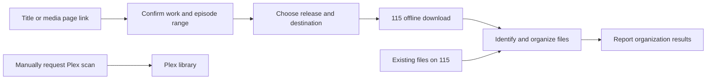

# telepiplex

**Search, download to 115, and organize your media from Telegram.**

[简体中文](README.md) · [Quick start](#quick-start) · [Everyday use](#everyday-use) · [Features](#feature-modules) · [MIT License](LICENSE)

telepiplex is a self-hosted media management tool. Send an exact title or a media page link, confirm the work and episode range, then choose a release and destination. It connects media search, 115 offline downloads, and file organization in one trackable task. You can also organize existing files on 115 and manage Plex libraries through a separate module.

A single Docker container runs the persistent Host. Business capabilities are installed and updated independently as Feature modules, with everyday controls in Telegram.



The automatic task ends with file organization. Plex scans are initiated separately and require your existing media access or mounting setup.

## What it does

- **Confirm the work before finding a release.** Wikipedia and Wikidata discover works; TVDB, TMDB, Douban, and AniList enrich confirmed records within their respective roles. You choose between ambiguous matches. Search does not require AI.
- **Search for a movie, full series, season, or episode.** Query your Prowlarr indexers, validate identity, year, and episode scope, then deduplicate and rank up to 12 releases.
- **Download to 115 and track progress.** Authorize through a QR code or Access/Refresh Tokens, choose a destination, and follow download status with automatic token refresh.
- **Organize actual files.** Identify movies, episodes, and external subtitles individually, and generate consistent paths and filenames. Files without a reliable mapping stay in place; destination conflicts are reported separately.
- **Manage modules in Telegram.** Install, configure, update, enable, disable, and roll back Features. Routine Feature updates do not require restarting the Host container.
- **Keep useful task records.** Each stage reuses its own status message, rejects stale buttons and duplicate submissions, and produces readable logs alongside structured diagnostics.

## Feature modules

| Feature | Purpose | Dependencies | Details |
| --- | --- | --- | --- |
| `download` | 115 authorization, offline downloads, storage access, and download cleanup | None | [download](features/download/README.md) |
| `search` | Work confirmation, episode selection, metadata enrichment, and release search | `download` | [search](features/search/README.md) |
| `rename` | Post-download organization, existing 115 media scans, file naming and moves | `download`, `search` | [rename](features/rename/README.md) |
| `sync` | Independent manual Plex scans, job inspection, and MCP management tools | None; Plex operations require a connection | [sync](features/sync/README.md) |
| `caption` | Reserved for subtitle discovery and normalization | No business functionality yet | [caption](features/caption/README.md) |

For the complete search and organization flow, install `download → search → rename` in that order. Install `sync` as needed. `caption` currently verifies packaging, installation, and startup only; it does not search for or process subtitles.

## Quick start

### 1. Prepare the environment

Use a server with Docker Compose. The official image currently targets **Linux / amd64**.

Have a Telegram Bot Token, your numeric Telegram user ID, and valid 115 authorization ready. Release search also needs a Prowlarr instance with configured indexers. The container must be able to reach Telegram, 115, and your enabled metadata services.

Download and extract the repository ZIP. From the extracted directory, prepare the configuration:

```bash
mkdir -p data
cp config/config.yaml.example data/config.yaml
```

Edit `data/config.yaml` and replace at least `bot_token` and `allowed_user`. `allowed_user` is a numeric user ID, not a username; the current access configuration allows one user.

```yaml
log_level: info
bot_token: "your_bot_token"
allowed_user: 123456789
plugins:
  root: /config/plugins
  catalog: https://raw.githubusercontent.com/countott/telepiplex/catalog/catalog.yaml
  catalog_refresh_interval: 21600
```

See the [full configuration template](config/config.yaml.example) for additional runtime settings. Host configuration covers the Bot and module runtime. Credentials and settings for 115, Prowlarr, and Plex belong to their respective Features.

### 2. Start the container

Edit [docker-compose.yaml](docker-compose.yaml). Replace the placeholder mount `/to/your/path/config:/config` with the directory you just prepared:

```yaml
volumes:
  - ./data:/config
```

Then run:

```bash
docker compose up -d
docker logs -f telepiplex
```

The default image is `ghcr.io/countott/telepiplex:latest`. The Bot receives messages through polling, so the default Compose setup does not expose ports. On Unraid, use the same image and map a persistent directory to `/config` inside the container.

The active Host configuration is `/config/config.yaml` inside the container. Prowlarr and Plex addresses must be reachable from the container; `127.0.0.1` inside it refers to the container itself.

### 3. Install and configure modules

Open your Bot in Telegram and send `/start`. Send `/plugin` to open module management.

Use the buttons to install `download`, `search`, and `rename` in that order. Only dependency-satisfied, ready candidates receive an Install button; missing dependencies are listed on the page. Install and Update buttons target that Feature's newest stable, Host-compatible release. telepiplex never installs automatically.

Send `/config`, choose a module, and follow its prompts:

| Module | Initial configuration |
| --- | --- |
| `download` | Use `/auth` to enter Access/Refresh Tokens or follow QR authorization; add at least one 115 destination under save directories |
| `search` | Set the Prowlarr address and API Key; configure a TMDB API Read Access Token and TVDB credentials as needed |
| `rename` | Check category destinations; configure an AI service only if you need help mapping filenames beyond the deterministic rules |
| `sync` (optional) | Set the Plex address and Token; configure TMDB and Fanart.tv as needed for artwork and other enhancements |

A save directory is entered in two steps: its button label, then its actual path. For example, enter `真人电影` as both label and path, or use a nested path such as `series/live action`. Do not start a path entered in Telegram with `/`, which Telegram treats as a command.

Both save directories and category destinations are **paths inside 115**. download's `save_directories` selects the offline download destination; search and rename use `category_folder` for media categories. Defaults separate live-action movies, animated movies, live-action series, and animated series. Keep both modules' category paths consistent when customizing them. Edit category arrays and other advanced settings in the relevant YAML file; each module's default configuration provides the field structure.

Wikipedia, Wikidata, Douban, and AniList do not require API Keys. search has no AI configuration. rename uses AI only for file mappings that rules cannot resolve; AI cannot confirm work identity, override external metadata, or authorize deletion. Saving configuration through Telegram validates it and switches the running instance; a failed switch restores the old configuration and routes.

## Everyday use

### Search and download

Send an exact title, optionally with a year or explicit episode range:

```text
/s Interstellar 2014
/s Westworld
/s Westworld S01
/s Westworld S01E01
```

You can also send a work page link from Douban, Wikipedia, Wikidata, TVDB, TMDB, or AniList directly to the conversation. Do not prefix links with `/s`.

Follow the prompts to confirm the work, select an available full-series, season, or episode scope, and choose a release and 115 destination. Download progress appears in Telegram. When the download completes, an enabled rename Feature handles organization. If rename is not installed or enabled, the download completes with an explicit notice that automatic organization was skipped.

Search requires an accurate media title. Descriptive discovery, typo inference, and screenshot recognition are not supported. Season 0, specials, OVA, OAD, and other extras are excluded from search. Unaired episodes, unknown air dates, or missing reliable episode inventories restrict the available selections; missing scope information is not guessed.

### Organize existing media

Send `/rename`, choose an existing 115 directory, and confirm the work as prompted. Organization uses evidence from the actual files; source folders do not need to follow a naming convention.

Typical output looks like this. Actual names come from confirmed metadata:

```text
真人电影/
└── 星际穿越 (Interstellar)/
    └── Interstellar.mkv

真人剧集/
└── 西部世界 (Westworld)/
    └── Westworld Season 01/
        ├── Westworld S01E01.mkv
        └── Westworld S01E01.chi.srt
```

Work folders use `Chinese Title (English Title)`. Media filenames use the confirmed English title and consistent season/episode numbering. External subtitles retain their real extension. The `.chi` suffix is a naming convention, not evidence that the subtitle language was detected as Chinese.

**Download cleanup and existing-media organization have different rules.** Before automatic handoff, download deletes non-video files and videos below `minimum_video_size_mib`, which defaults to **100 MiB**. This includes external subtitles in the download package. Setting the threshold to `0` still filters non-video files. If there is no qualifying video, cleanup stops before deletion. When organizing existing media, `/rename` keeps unmatched files and subtitles in place and reports items needing attention. If you need to preserve files accompanying a download, review the [download cleanup behavior](features/download/README.md) first.

### Manage Plex

After installing and configuring `sync`, send `/scan` to scan one or all Plex libraries, or `/sync` to inspect jobs. `/scan` only submits a library scan; it does not create artwork, audio, or subtitle enhancement jobs.

telepiplex does not mount 115 storage for Plex. Make media accessible to Plex through your existing setup. Organization does not automatically trigger a Plex scan. See the [sync documentation](features/sync/README.md) for the MCP management interface.

### Common commands

| Command | Purpose |
| --- | --- |
| `/start` | Show currently available functionality |
| `/plugin` | Install, update, and manage Features |
| `/config` | Configure installed Features |
| `/auth` | Set up 115 authorization |
| `/s`, `/search` | Search by exact media title |
| `/m`, `/magnet` | Submit a magnet link, for example `/m magnet:?xt=urn:btih:…` |
| `/rename` | Scan and organize existing media on 115 |
| `/scan` | Manually scan Plex libraries |
| `/sync` | Inspect Plex jobs |

Menus reflect enabled modules whose dependencies are available. One interaction can be active per user at a time. Use the current message's cancellation controls while a task runs. **Exit** closes an interaction before execution. **Cancel task** stops subsequent work and reports remote changes already made. **Cancel and roll back** is offered only when the completed changes have verifiable inverse operations. Canceling a download does not delete downloaded files.

## Configuration, logs, and updates

All persistent data lives under `/config`. Preserve the whole directory when backing up:

| Container path | Contents |
| --- | --- |
| `/config/config.yaml` | Host and Telegram configuration |
| `/config/plugins/<plugin_id>/config.yaml` | Private Feature configuration |
| `/config/plugins/<plugin_id>/config.yaml.example` | Installed Feature configuration template |
| `/config/plugins` | Module versions, environments, and persistent state |
| `/config/logs` | Logs grouped by Host startup session |

Follow the current logs:

```bash
docker logs -f telepiplex
```

Each Host startup creates a session directory under `/config/logs/`, containing `telepiplex.human.log`, `telepiplex.machine.jsonl`, and corresponding `feature-<plugin_id>` views. Human logs provide a Chinese business timeline; JSONL preserves structured diagnostics. Sensitive fields are redacted. Complete sessions are retained for at most 30 startups and 30 days.

Update Features through `/plugin`. The Host refreshes the official catalog at startup and checks again every six hours by default. Available updates are sent to the authorized user; the transaction runs only after they select “Confirm update” (确认更新). telepiplex never updates silently. It verifies the package, checks a separate new process, drains old work, and switches routes. A failed update keeps the old version.

Updating the Host image requires recreating the container:

```bash
docker compose pull
docker compose up -d
```

Host and Feature releases are independent. Updating the image does not update installed modules. When a Feature requires a newer Host API, update the Host first, then update Features in dependency order.

<details>
<summary><strong>Advanced configuration, offline installation, and compatibility</strong></summary>

### Advanced/offline operations

Use `/plugin` buttons for normal installation. To select an exact version or local artifact, use `/plugin install <name@version|artifact.tpx>` or `/plugin update <name@version|artifact.tpx>`. Both also accept an existing absolute `.tpx` path inside the container.

The first two examples below illustrate historical version syntax only. Choose an available, compatible version from your catalog when using them:

```text
/plugin install search@1.0.0
/plugin update search@1.0.0
/plugin enable search
/plugin disable search
/plugin rollback search
/plugin remove search
/plugin status search
/plugin doctor
```

`plugins.catalog` accepts an HTTPS URL or local file. The official rolling endpoint is `https://raw.githubusercontent.com/countott/telepiplex/catalog/catalog.yaml`. Feature Releases include a complete catalog snapshot; save it as `/config/plugins/catalog.yaml` and point the configuration there if needed. Offline use also requires the corresponding artifacts and runtime dependencies.

The legacy default catalog is `<plugins.root>/catalog.yaml`; telepiplex falls back to the official URL only when that legacy file is missing. An existing legacy file remains local, and every other explicit local path preserves its local configuration intent even when its file is missing. Failed remote refreshes preserve the last valid catalog.

### Large directories and older configurations

download's `enable_tree_snapshot_references` defaults to off, with a complete-tree limit of 1,000 descendant nodes. Enable it only after both download and rename support paged snapshots. When enabled, the limit becomes 20,000 nodes and depth 8, with all pages and digests checked before organization. Snapshot databases currently have no automatic garbage collection, so disk use grows with tasks. Preserve both modules' snapshots and active tasks before rollback. See [download](features/download/README.md) and [rename](features/rename/README.md) for the procedure.

The current search-to-organization flow uses `media_metadata v2`. Read each module's migration notes before upgrading older installations: search removes its old AI configuration through a package migration, while sync's old `ai:` section needs the treatment described in its documentation. Do not assume active tasks from older versions can migrate automatically.

### Local image

Source builds use the separate image identity `telepiplex:latest`:

```bash
./build.sh
TELEPIPLEX_IMAGE=telepiplex:latest \
TELEPIPLEX_PULL_POLICY=never \
docker compose up -d
```

Local builds do not change the official `ghcr.io/countott/telepiplex:latest` image.

</details>

<details>
<summary><strong>Architecture, releases, and development</strong></summary>

### Host and Features

The Host owns Telegram access, command routing, durable tasks and events, configuration, and module lifecycles. Each Feature runs in its own Python virtual environment and subprocess. Capabilities are called over Unix Domain Sockets under the temporary `/tmp/telepiplex` directory. Business source is not bundled into the Host image, and Features do not directly import one another.

The current Host API 1.7 provides durable operation message segments, reusing one message within a stage and handling duplicate callbacks, sealing, and recovery. It retains identity/stage milestones from Host API 1.6 and versioned configuration migrations from Host API 1.5. Each module declares its `host_api` range and capability dependencies in `manifest.yaml`.

### Independent releases

`main` is the active source branch for Core/Host and all five Features. The Host uses `telepiplex-v<semver>` tags, with release commits verified as contained in remote `main`. The release workflow publishes `ghcr.io/<owner>/telepiplex:<semver>` and `latest`, then creates a same-tag GitHub Release explicitly marked **Latest**. An ordinary `main` push does not update official images or Latest entry points.

Features use independent `<plugin_id>-v<semver>` tags and immutable `.tpx` artifacts identified by `name@version`. The Feature version in `manifest.yaml` must match its package version. Changed contents require a new version; published identities are not overwritten. Feature Releases do not take the Latest label, and Host Releases contain no Feature or catalog assets.

Each Feature release updates `catalog.yaml` and its checksum on the `catalog` branch. Entries record artifact URLs, SHA-256, source commits, compatibility ranges, and capability dependencies. The Feature Release also includes a complete catalog snapshot.

The five modules are new technical identities whose original tags were `download-v1.0.0`, `search-v1.0.0`, `rename-v1.0.0`, `sync-v1.0.0`, and `caption-v0.1.0`. These are historical starting tags, not current version recommendations. Old `plugin_id` installations do not migrate automatically to the new identities. Retired-branch maintenance is recorded in the [archive notes](docs/archive/2026-07-26-feature-telepiplex-core.md).

### Development and verification

| Directory | Contents |
| --- | --- |
| `app/` | Host runtime, Telegram interactions, and module management |
| `sdk/` | Feature SDK and shared contracts |
| `features/` | Source, configuration, and tests for the five Features |
| `tools/` | `.tpx` builders, release validation, and audit tools |
| `examples/echo_feature/` | Minimal Feature example |
| `tests/` | Host, SDK, and cross-module contract tests |

Use Python 3.12 for local development. After installing project, SDK, relevant Feature dependencies, and pytest, run from the source root:

```bash
PYTHONDONTWRITEBYTECODE=1 PYTHONPATH=.:sdk/src \
  python3 -m pytest -q -p no:cacheprovider tests

for module in download search rename sync caption; do
  (
    cd "features/$module"
    PYTHONDONTWRITEBYTECODE=1 PYTHONPATH=src:../../sdk/src \
      python3 -m pytest -q -p no:cacheprovider tests
  )
done
```

The maintainer workspace follows [AGENTS.md](AGENTS.md): development and local validation on the Mac, Syncthing transfer to Unraid, and user-operated Git and publication on Unraid. Local test results and actual deployment results are recorded separately; see the [business-flow verification record](docs/audits/2026-09-05-iteration-results.md).

</details>

## License

telepiplex is available under the [MIT License](LICENSE). Third-party dependencies retain their respective licenses; module directories contain the relevant notices.
